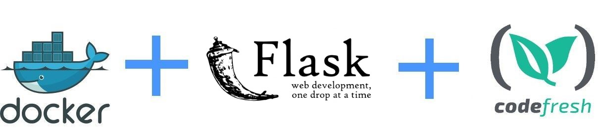

## Flaskr an example application written in Python/Flask

Original source code from https://github.com/pallets/flask/tree/master/examples/tutorial

## Docker instructions

To create a docker image execute: 

`docker build . -t flaskr`

To run the docker image execute:

`docker run -p 5000:5000 flaskr` and visit with your browser http://localhost:5000

To run unit tests inside the container execute:

`docker run -it flaskr /bin/sh`

and then in the new command promt run

`pip install pytest && pytest`

